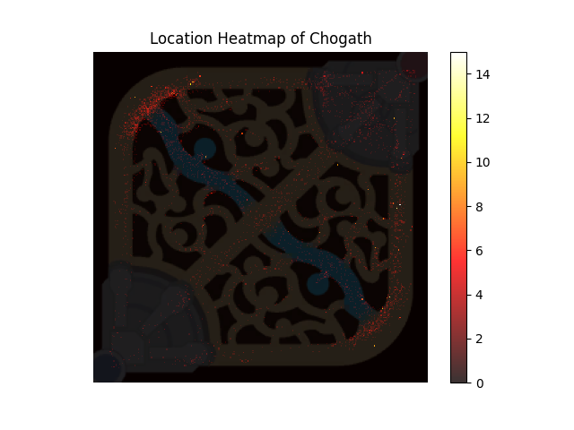
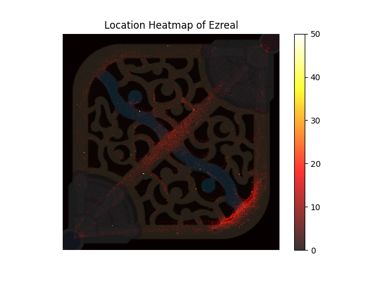
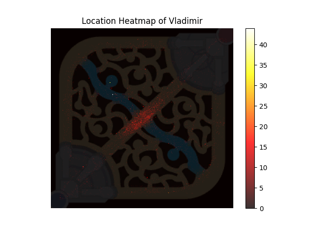

# League of Legends Champion Heatmaps

A small project with a script for generating heatmaps from League of Legends champion location data.

## Overview
This project is a preliminary proof-of-concept for handling and analysing spatial data of League of Legends champions movements around the Summoner's Rift. It can generate heatmaps from spatial data of a specific format.

The project utilises as an example data set spatial data extracted from the [DeepLeague](https://github.com/farzaa/DeepLeague) dataset.

## Example output





[See the rest of the DeepLeague champion location heatmaps here.](example_output/)

## Getting Started
### Prerequisites
- Python 3.x

### Installation
1. Ensure you have Python 3 installed
2. Clone the repository:
   ```bash
   git clone https://github.com/Tapiiri/lol-movement-project.git
   ```
3. Install the required packages
   ```bash
   pip install -r requirements.txt
   ```

## Usage with Own Data

If you would like to use this project to visualize your own data, you would have to convert your data to a format usable by this project. You can either format your data directly as centerpoints, or you can use the `convert_deep_league_to_centerpoints.py` script to convert bounding box data (in similar format as the DeepLeague dataset)

### Using Centerpoints Directly

The centerpoint data should be stored in an `.npz` file, which is a zipped archive of multiple Numpy arrays. The file must contain at least two arrays with the keys `'classes'` and `'centerpoints'`.

- `'classes'`: A 1D Numpy array where each element is an integer representing the class label of a centerpoint.
- `'centerpoints'`: A 2D Numpy array where each row represents the (x, y) coordinates of a centerpoint.

The `'classes'` array and the `'centerpoints'` array should have the same length, with each element (class label) in `'classes'` corresponding to the centerpoint at the same index in `'centerpoints'`.

Example format:
```plaintext
classes = np.array([0, 1, 1, 0, ...])
centerpoints = np.array([
    [100, 200],
    [150, 250],
    [200, 300],
    [250, 350],
    ...
])
```

#### Class Names File

Alongside the `.npz` file, you should provide a plain text file containing the class (champion) names. Each line in the file represents a champion, with the line number (starting from zero) corresponding to the class label in the `'classes'` array.

Example format:
```plaintext
Ezreal
Lulu
Sion
...
```

Ensure that your class names file has the exact number of lines as the number of unique classes in your `'classes'` array, and that the class labels are zero-indexed and sequential.

### Converting from DeepLeague Bounding Box Format

Before converting to centerpoints, ensure that your bounding box data is organized as follows:

- Each bounding box is represented by a list or array of five elements: `[class_label, x_min, y_min, x_max, y_max]`.
- `class_label` is an integer that corresponds to the class of the object.
- `(x_min, y_min)` are the coordinates of the top left corner of the bounding box.
- `(x_max, y_max)` are the coordinates of the bottom right corner of the bounding box.

The bounding box data should be collated into a list (or array) where each element is one of the bounding box representations mentioned above.

Example format:
```plaintext
bounding_boxes = [
    [0, 30, 40, 120, 160],   # Bounding box for class 0
    [1, 50, 60, 180, 200],   # Bounding box for class 1
    ...
]
```

To convert your bounding box data to the centerpoint format required by this project, you can use the `convert_deep_league_to_centerpoints.py` script. This script will process your bounding box data to extract the centerpoints and save them, along with the class labels, into an `.npz` file.

Use the following steps to perform the conversion:

1. Ensure that your bounding box data is in the correct format as described above.
2. Run the `convert_deep_league_to_centerpoints.py` script with the bounding box data file as input.
3. The script will create an `.npz` file containing the `'classes'` and `'centerpoints'` arrays, ready for use with the visualization tools.

Example command:
```bash
python convert_deep_league_to_centerpoints.py --data_path path_to_your_bounding_box_file.txt --output_path path_to_output_centerpoint_file.npz
```
   
### Scripts
#### `visualize_centerpoints.py`

Generates separate heatmaps from spatial data for each of the champions.

##### Usage
```bash
python visualize_centerpoints.py [-h] [-o OUTPUT_FOLDER] [-f FILE_NAMES [FILE_NAMES ...]] [-c CLASS_NAMES]
```

##### Arguments
- `-h, --help`: Show the help message and exit.
- `-o, --output-folder OUTPUT_FOLDER`: Optional. Specify the output folder for the saved heatmap images. Defaults to "output".
- `-f, --file-names FILE_NAMES`: **Required**. Provide a list of NPZ filenames *or* a single filename containing NPZ filenames, corresponding to the file(s) with your spatial data. See data/npz_file_paths.example.txt for an example filename file.
- `-c, --class-names CLASS_NAMES`: Optional. Specify a file containing a list of champion names corresponding to the numerical class labels in the data (e.g., the first class name is for class 0). See data/class_names.txt for an example.

##### Example Usage
```bash
python visualize_centerpoints.py -f data/centerpoints.npz -c data/class_names.txt
```

---

#### `convert_deep_league_to_centerpoints.py`

The `convert_deep_league_to_centerpoints.py` script is utilized for converting DeepLeague bounding box data from NPZ files into centerpoints and saving these centerpoints into a new NPZ file. This script was used in creating the centerpoints.npz file in the data folder.

##### Usage
```bash
python convert_deep_league_to_centerpoints.py -o OUTPUT_PATH -f FILE_NAMES -c CLASS_NAMES
```

##### Arguments
- `-o`, `--output-path`: Optional. Specify the path to the output NPZ file. Defaults to "output.npz".
- `-f`, `--file-names`: Required. List of NPZ file names or a file containing NPZ file names.
- `-c`, `--class-names`: Optional. List of class names in sequential order corresponding to the classes in the NPZ files.

---

## Acknowledgements
Thanks for [Faarza](https://github.com/farzaa) for [creating the DeepLeague dataset using computer vision](https://github.com/farzaa/DeepLeague). It's one of the very few (so far the only one that I've found) spatial datasets of League of Legends champion location data, and it was crucial in getting this prototype up and running without requiring data collection!